#  ECE564 HW1 - Simple App with Data Model

## Extra Functionality

### 1.Enhancements to the User Interface
- Add widths and heights constants, and automatically calculate the position of each components, so don't need to change in everywhere, if the device heights and widths changed.
- Add pre-defined colors in /Constant/Colors.swift, so only change in this file can change the App's theme.
- Very elegant and user-friendly user interface.

### 2.Interesting and/or broad use of Swift capabilities
- Use SwiftUI scrollView to implement the output textfield, and whenever there is a new output, the scrollview will automatically scroll to the bottom.
- Use Date() class to print every log time.

### 3.Interesting algorithm
- Use a dictionary to store the data, and use the key to search the data, which is very efficient.

<br />

## Code Reference

#### 1.With the help of ChatGPT, I learn how to scroll to the bottom of the scrollview automatically whenever there's a new output.
```swift
let contentHeight = outputView.contentSize.height
let offsetY = max(0, contentHeight - scrollView.bounds.size.height)
outputView.setContentOffset(CGPoint(x: 0, y: offsetY), animated: true)
```

#### 2.Also with ChatGPT, I learn how to disable the input textfield auto-correction and auto-capitalization.
```swift
inputFieldParam.autocapitalizationType = UITextAutocapitalizationType.none
inputFieldParam.autocorrectionType = .no
```

<br />

## Usage

### Input Instruction

```text
--------------------------------------- Help ---------------------------------------
Format:
fn=first_name, ln=last_name, em=email,
ro=role, ge=gender, fr=from
- ro must be one of: Student, TA, Professor, Staff, or will be Other
- ge must be one of: Male, Female, otherwise will be Other
- Either of these parameters must not contains ',', space, or '='
- The order of parameters does not matter

1. Add: Add a person to the database.
    DUID is required, all other parameters are optional.
2. Update: Update or add a person with given DUID.
    DUID is required, all other parameters are optional.
3. Delete: Delete a person with given DUID.
    DUID is required, all other parameters are ignored.
4. Find: Find a person with given DUID or given name.
    Either DUID or lName is required, fName is default with "*".
    Use "*" to represent any name.
5. List All: List all people in the database.
6. Help: Show this help message.

CopyRight: Yadong (Hugo) Hu, 2023
------------------------------------------------------------------------------------
```

### Test Cases

#### Add

**Valid:**
- 1.Add a person with DUID but no parameters
```
123456
```
```

```


- 2.Add a person with DUID and full parameters
```
123457
```
```
fn=Hugo, ln=Hu, em=test.1@duke.edu, ro=Student, ge=Male, fr=Durham
```


- 3.Add a person with DUID and partial parameters
```
123458
```
```
fn=Andrew, ln=Hu, em=test.2@duke.edu, ro=TA
```

|---|---|---|
|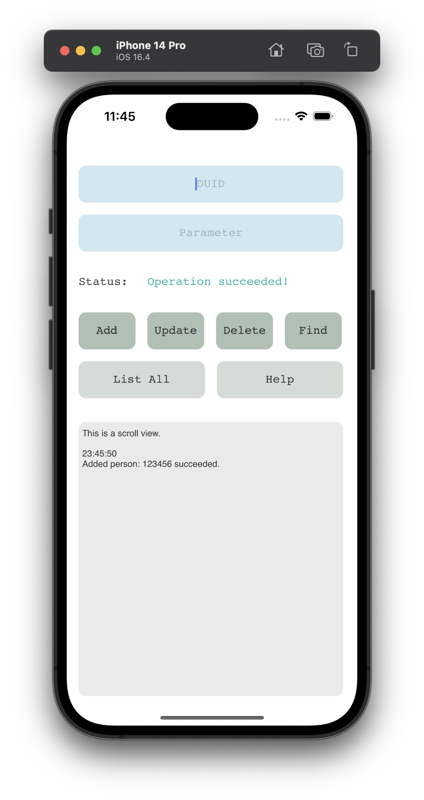 |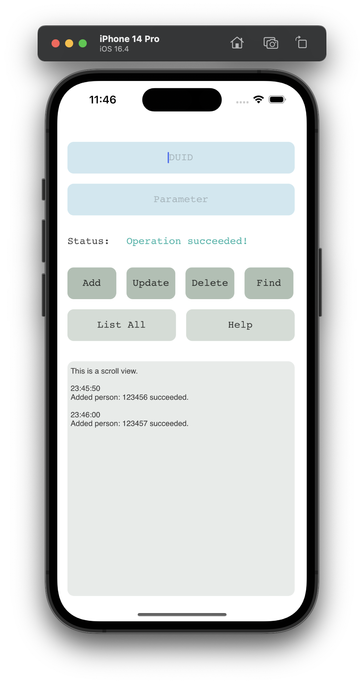 |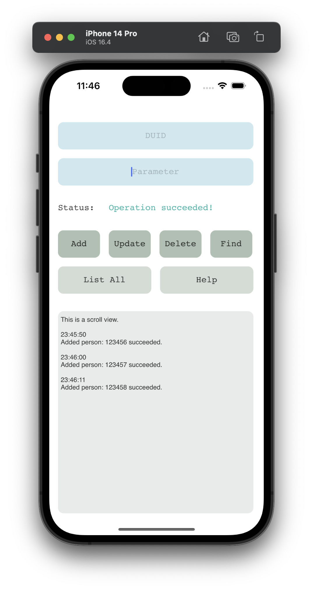 |
|---|---|---|

- 4.DUID provided, but parameter contains invalid notations
```
123459
```
```
fn=Hugo, lnHu
```
**In this case, the invalid part will be ignored**


**Invalid:**
- 5.DUID not provided
```

```
```
fn=Hugo, ln=Lei, em=test.3@duke.edu, ro=Student, ge=Male, fr=Durham
```


- 6.DUID exists
```
123459
```
```

```

|---|---|---|
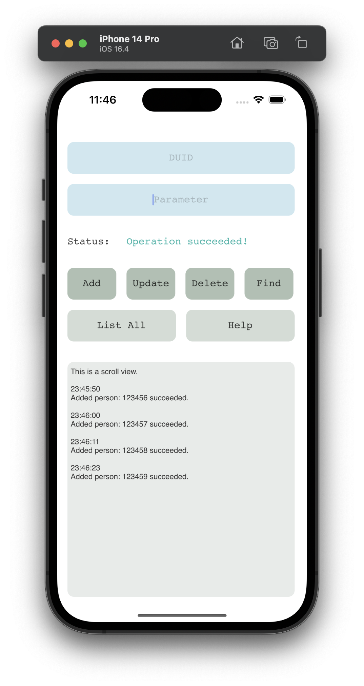 |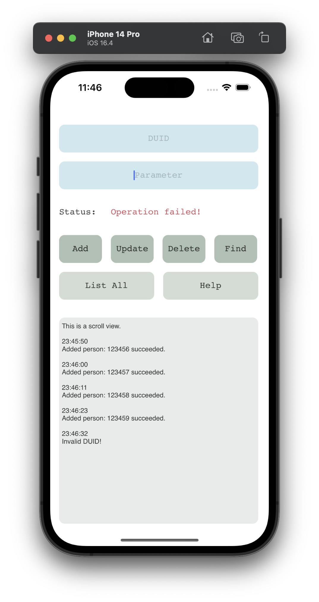 | 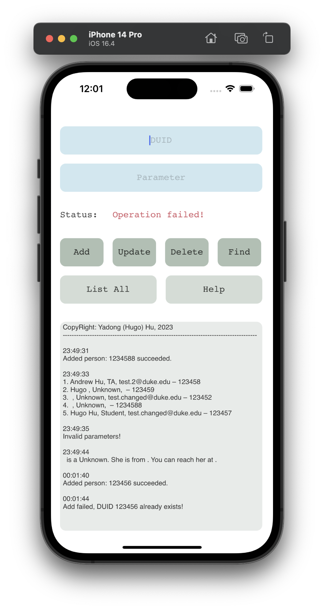|
|---|---|---|

#### Update
**Valid:**
- 7.Update with existing DUID and full parameters
```
123456
```
```
fn=Carol, ln=Lei, em=test.4@duke.edu, ro=Teacher, ge=SomethingElse, fr=New York
```


- 8.Update with existing DUID and partial parameters
```
123457
```
```
em=test.changed@duke.edu
```


- 9.Not existing DUID
```
123452
```
```
em=test.changed@duke.edu
```
**In this case, a new record will be added**


|---|---|---|
|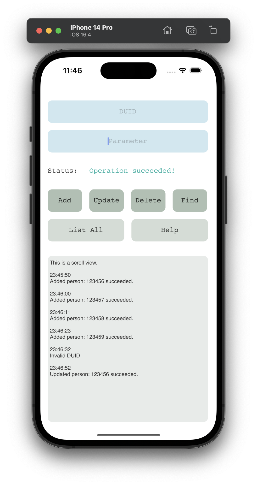|||
|---|---|---|

**Invalid:**
- 10.DUID exists, but parameter is empty
```
12345
```
```

```


#### Delete
**Valid:**
- 11.Delete with existing DUID
```
123456
```
```

```


**Invalid:**
- 12.Not existing DUID
```
12345
```
```

```


|---|---|---|
|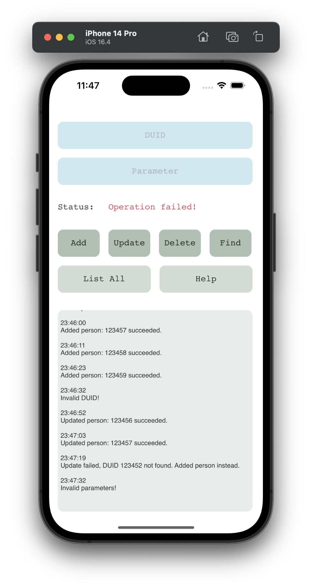||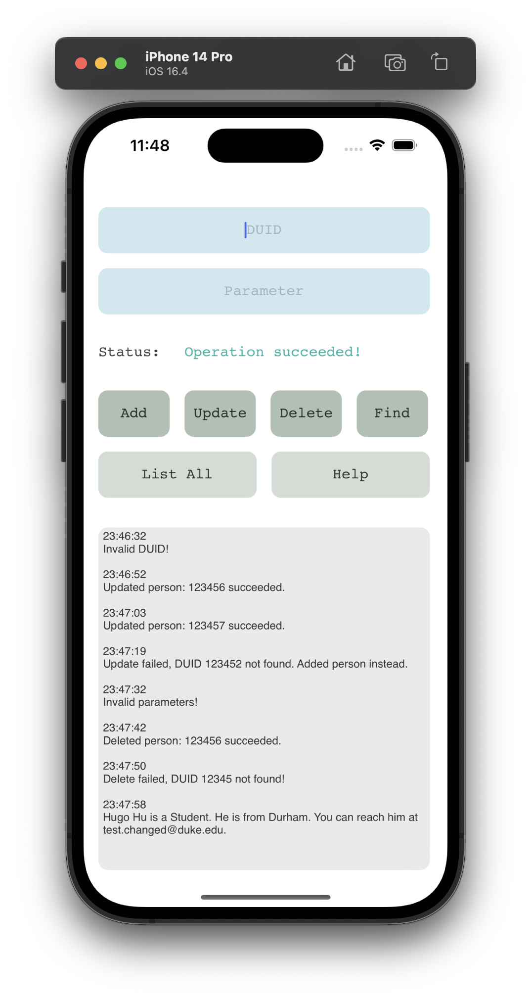|
|---|---|---|

#### Find
**Valid:**
- 13.Find with existing DUID
```
123457
```
```

```


- 14.Find with existing last name
```

```
```
ln=Hu
```


- 15.Find with exsiting first name and last name
```

```
```
fn=Andrew, ln=Hu
```


|---|---|---|
|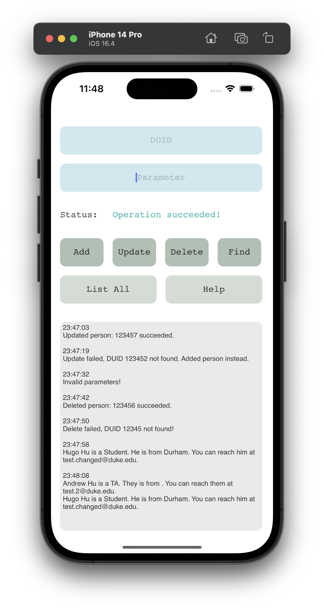|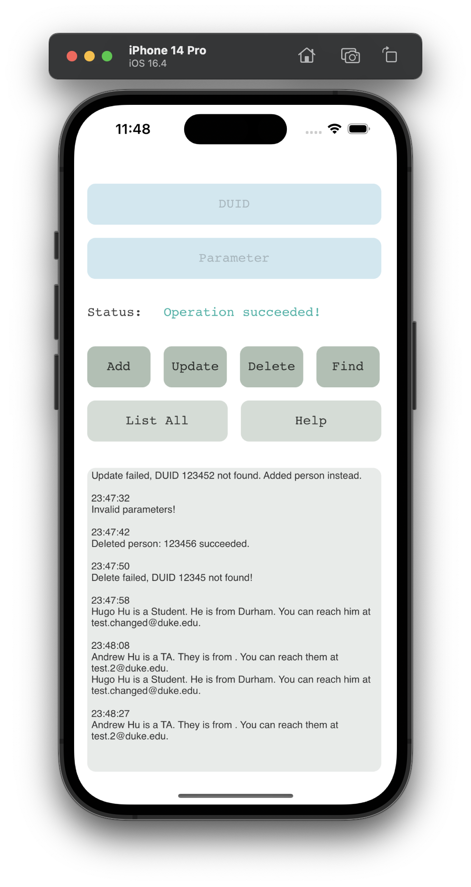|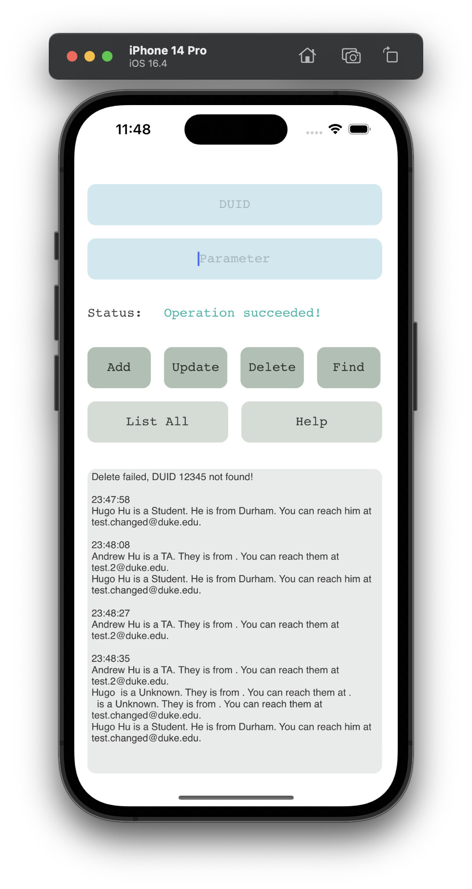|
|---|---|---|

- 16.Find with any name
```

```
```
ln=*,fn=*
```


**Invalid:**
- 17.Not existing DUID
```
123456
```
```

```


- 18.Not existing name
```

```
```
ln=Teleford
```

|---|---|---|
|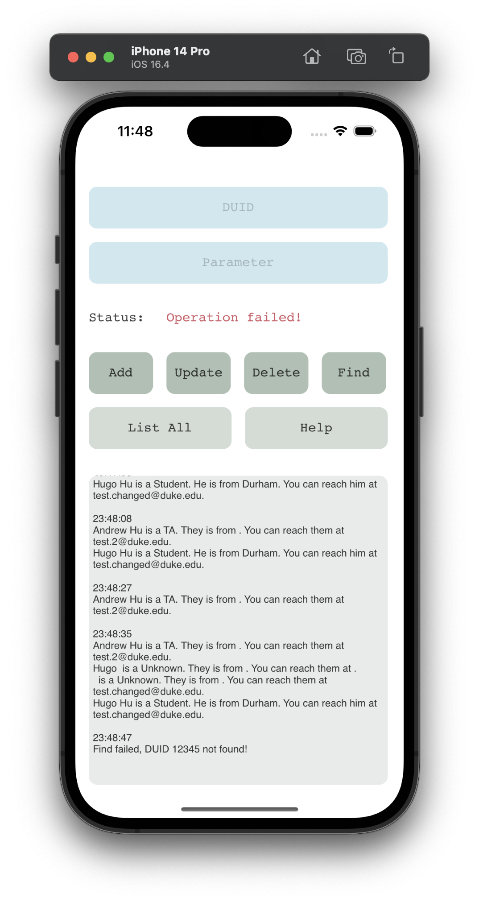||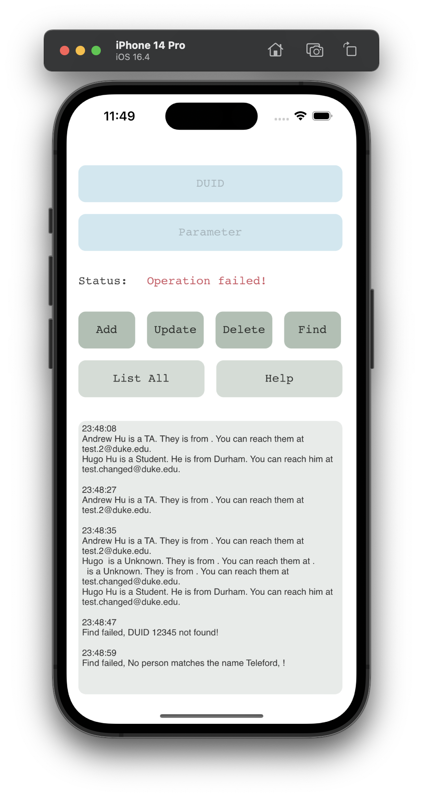|
|---|---|---|

#### List All
**Valid:**
- 19.List all people in the database
```

```
```

```


#### Help
**Valid:**
- 20.Show help message
```

```
```

```

|---|---|---|
|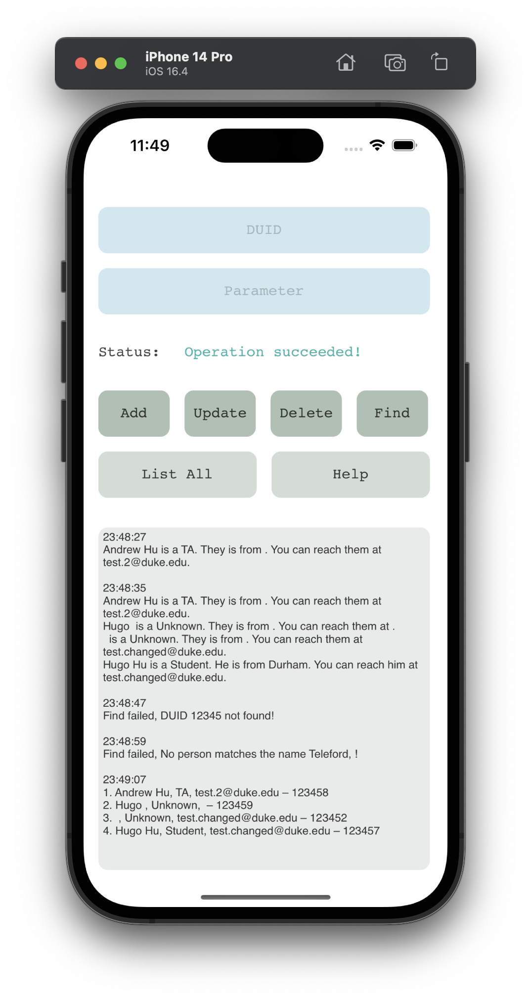|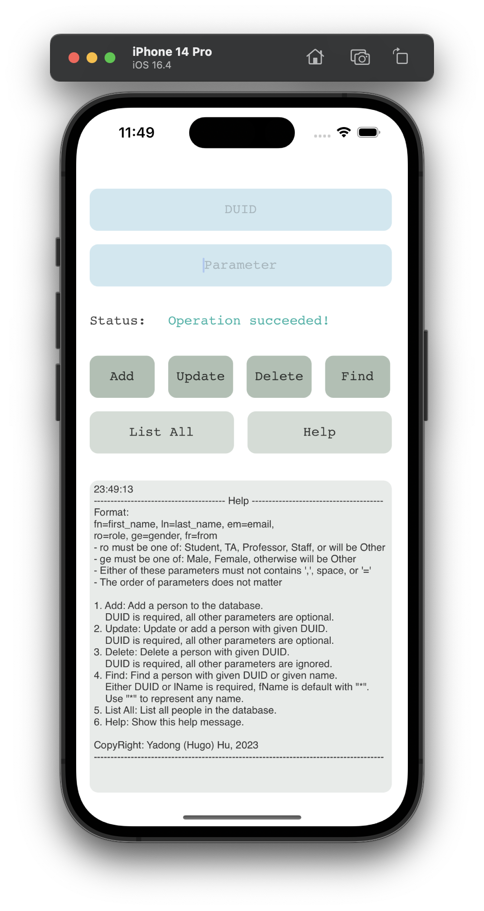|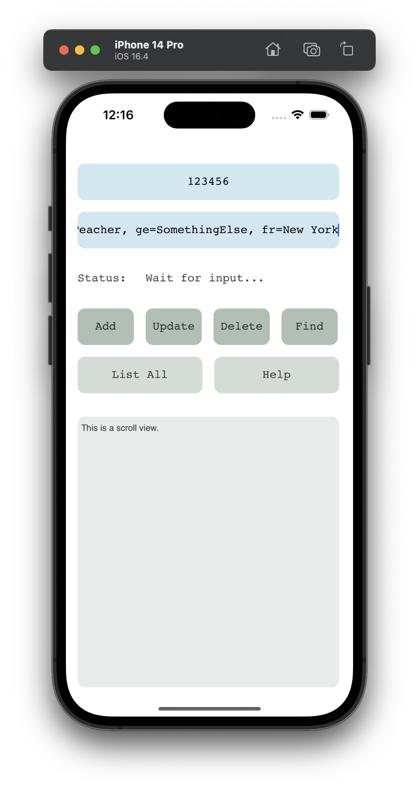|
|---|---|---|
